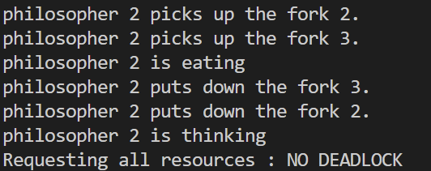
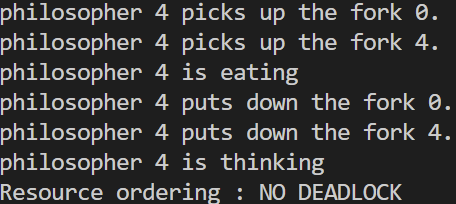
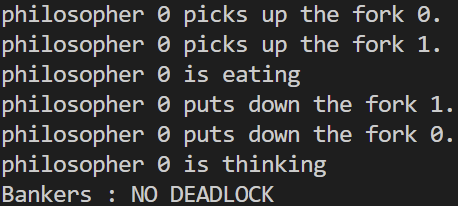
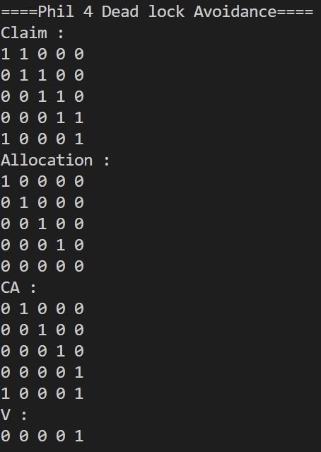

# Dining Philosophers Problem
## Overview
**Dining Philosophers Problem**을 직접 해결해보며 느낀점과 평가를 내린다.
### 개발 환경
Ubuntu 24.04.1 LTS  
gcc 13.3.0  
WSL 2.6.3.0  
## Problem
**Dining Philosophers Problem**은 상호 배제 문제와 Deadlock 문제가 동시에 나타나는 문제이다.    
각 포크에 대해 상호 배제를 시켜줘야 하면서,  
철학자들이 Deadlock에 걸리지 않도록 만들어야 한다.
```c
#include <stdio.h>
#include <pthread.h>
#include <semaphore.h>
#define NUM 5

sem_t forks[NUM]; // forks

void pickup(int philosopher_num)
{
    sem_wait(&forks[philosopher_num % NUM]);
}
void putdown(int philosopher_num)
{
    sem_post(&forks[philosopher_num % NUM]);
}
void thinking(int philosopher_num)
{
    printf("philosopher %d is thinking\n", philosopher_num);
    return;
}
void eating(int philosopher_num)
{
    printf("philosopher %d is eating\n", philosopher_num);
    return;
}
void *philosopher(void *arg)
{
    int philosopher_num;
    philosopher_num = (unsigned long int)arg;
    while (1)
    {
        pickup(philosopher_num);
        printf("philosopher %d picks up the fork %d.\n", philosopher_num, philosopher_num);
        pickup(philosopher_num + 1);
        printf("philosopher %d picks up the fork %d.\n", philosopher_num, (philosopher_num + 1) % NUM);
        eating(philosopher_num);
        putdown(philosopher_num + 1);
        printf("philosopher %d puts down the fork %d.\n", philosopher_num, (philosopher_num + 1) % NUM);
        putdown(philosopher_num);
        printf("philosopher %d puts down the fork %d.\n", philosopher_num, philosopher_num);
        thinking(philosopher_num);
    }
    return NULL;
}

int main()
{
    pthread_t threads[NUM];
    for (int i = 0; i < NUM; i++)
    {
        sem_init(&forks[i], 0, 1);
    }
    for (unsigned long int i = 0; i < NUM; i++)
    {
        pthread_create(&threads[i], NULL, philosopher, (void *)i);
    }
    for (int i = 0; i < NUM; i++)
    {
        pthread_join(threads[i], NULL);
    }
    printf("NO DEADLOCK\n");
    return 0;
}
```
예시 코드는 이렇게 5명의 철학자가 5개의 포크를 공유하는 형태이다.  
이 코드는 아무런 제한을 하지 않아 5명의 철학자가 각자 1개의 포크를 갖게 되는 Deadlock이 나타난다.
## Solution
### Request All Resources
```c
void *philosopher(void *arg)
{
    ```
    while(1) {
        sem_wait(&m);
        pickup(philosopher_num);
        printf("philosopher %d picks up the fork %d.\n", philosopher_num, philosopher_num);
        pickup(philosopher_num + 1);
        printf("philosopher %d picks up the fork %d.\n", philosopher_num, (philosopher_num + 1) % NUM);
        sem_post(&m); 
        ```
    } 
    ```
}
```
**m** semaphore 변수는 초기값을 1로 설정해서 포크를 집는 2번의 행동을 상호 배제 시킨다.  
포크를 하나씩 pick up하지 않고 상호배제를 함으로써 두 포크를 원자적으로 pickup한다.  
이렇게 되면 **Hold and Wait**을 방지하기 때문에 Deadlock이 나타나지 않지만  
한명씩만 포크를 pick up하기 때문에 Concurrency를 해친다.  

### Resource Ordering
```c
void *philosopher(void *arg)
{
    ```
    while(1) {
        if (philosopher_num < 4)
        {
            pickup(philosopher_num);
            printf("philosopher %d picks up the fork %d.\n", philosopher_num, philosopher_num);
            pickup(philosopher_num + 1);
            printf("philosopher %d picks up the fork %d.\n", philosopher_num, (philosopher_num + 1) % NUM);
        }
        else
        {
            pickup(philosopher_num + 1);
            printf("philosopher %d picks up the fork %d.\n", philosopher_num, (philosopher_num + 1) % NUM);
            pickup(philosopher_num);
            printf("philosopher %d picks up the fork %d.\n", philosopher_num, philosopher_num);
        }
        ```
    } 
    ```
}
```
Resource의 순서를 정한다. 이 경우에서는 포크의 번호가 낮은 것부터 pick up 한다.  
philosopher_num이 3까지는 philosopher_num → philosopher_num + 1 순서로 pick up한다.  
philosopher_num이 4면 philosopher_num + 1 → philosopher_num 순서로 pick up한다.  
% 연산이 pick up 함수 안에 있기 때문에 4번째 철학자는 0번 포크 → 4번 포크 순서로 pick up 한다.  
이렇게 되면 **Circular Wait**을 방지하므로 Deadlock이 나타나지 않는다.
### Banker's Algorithm
```c
bool safe(int phil, int fork)
{
    if (!V[fork])
        return false;
    bool res = true;
    int tmp_CA[NUM][NUM];
    for (int i = 0; i < NUM; ++i)
        for (int j = 0; j < NUM; ++j)
            tmp_CA[i][j] = CA[i][j];
    int tmp_V[NUM];
    for (int i = 0; i < NUM; ++i)
        tmp_V[i] = V[i];
    tmp_CA[phil][fork] = 0;
    tmp_V[fork] = 0;

    bool finished[NUM];
    for (int i = 0; i < NUM; ++i)
        finished[i] = false;
    while (true)
    {
        bool nxt = true;

        for (int i = 0; i < NUM; ++i)
        {
            if (finished[i])
                continue;
            nxt = true;
            for (int j = 0; j < NUM; ++j)
            {
                if (tmp_CA[i][j] > tmp_V[j])
                    nxt = false;
            }
            if (nxt)
            {
                tmp_CA[i][i] = 0;
                tmp_CA[i][(i + 1) % NUM] = 0;
                tmp_V[i] = 1;
                tmp_V[(i + 1) % NUM] = 1;
                finished[i] = true;
                break;
            }
        }

        if (!nxt)
        {
            return false;
        }

        bool com = true;
        for (int i = 0; i < NUM; ++i)
        {
            if (!finished[i])
                com = false;
        }
        if (com)
            break;
    }
    return res;
}

void pickup(int phil, int fork)
{
    sem_wait(&forks[fork]);
    Allocation[phil][fork] = 1;
    CA[phil][fork] = 0;
    V[fork] = 0;
}
void putdown(int phil, int fork)
{
    sem_post(&forks[fork]);
    Allocation[phil][fork] = 0;
    CA[phil][fork] = 1;
    V[fork] = 1;
}

void *philosopher(void *arg)
{
    int philosopher_num;
    philosopher_num = (unsigned long int)arg;
    for (int cnt = 0; cnt < ITER; ++cnt)
    {
        sem_wait(&m);
        if (safe(philosopher_num, philosopher_num))
            pickup(philosopher_num, philosopher_num);
        else
        {
            cnt--;
            sem_post(&m);
            usleep(100);
            continue;
        }
        sem_post(&m);
        printf("philosopher %d picks up the fork %d.\n", philosopher_num, philosopher_num);
        sem_wait(&m);
        if (safe(philosopher_num, (philosopher_num + 1) % NUM))
            pickup(philosopher_num, (philosopher_num + 1) % NUM);
        else
        {
            putdown(philosopher_num, philosopher_num);
            cnt--;
            sem_post(&m);
            usleep(100);
            continue;
        }
        sem_post(&m);
        ```
    }
    ```
}
```
Banker's Algorithm은 safe 함수를 통해 자원을 할당 해줬을 때  
deadlock이 될 가능성이 있으면 할당을 안해주는 알고리즘이다.  
**safe 함수의 동작 원리**
1. 원래 변수들을 tmp 변수에 복사하여 시뮬레이션 환경을 만든다.
2. 가상으로 요청한 자원을 할당한 상태로 만든다.
3. 모든 철학자가 차례로 식사를 마칠 수 있는 순서(safe sequence)가 존재하는지 탐색한다.
4. 모든 철학자가 식사를 마칠 수 있다면 **safe state**이므로 true 반환.
5. 어떤 철학자도 진행할 수 없는 상태에 도달하면 **unsafe state**이므로 false 반환.

철학자는 포크를 pick up하기 전에 safe 함수를 호출하여 안전한 경우에만 자원을 할당받는다.  
unsafe하면 자원을 할당받지 않고 대기하며, 이미 한 개의 포크를 들고 있는 상태에서 unsafe하면 들고 있던 포크도 내려놓는다.

## Implementation Result
| DP_Req | DP_Res | DP_Banker's |
| :-: | :-: | :-: |
|  |  |  |

3가지 구현 모두 Deadlock이 발생하지 않는다.

  
Banker's Algorithm이 정말로 Deadlock을 감지하고 회피하는지 검증 출력을 넣어봤다.  
Philosopher 4가 no.4 포크를 pick up 하려고 할 때 Dead lock이 발생할 것을 계산해서 Dead lock을 피했다는 출력이다.  
그때의 Claim, Allocation, C - A, V 변수를 출력했다.
## Evaluate
linux의 time 명령어로 ITER가 1000000(철학자가 밥을 1000000번씩 먹음)일 때 걸리는 시간을 측정했다.  
걸리는 시간에 printf로 출력하는 시간이 비중이 크기 때문에 > /dev/null 명령어로 출력 없이 측정했다.  
결과를 예측해보면 한번에 한명만 포크를 들 수 있는 Request all Resources가 가장 느리고,  
알고리즘 구현이 복잡한 Banker's Algorithm이 그 다음일 것 같다. 가장 빠른 것은 Resource Ordering이 될 것 같다.
| | T1 | T2 | T3 | T4 | T5 | AVG |
| :-: | :-: | :-: | :-: | :-: | :-: | :-: |
| DP_Req | real : 11.830s <br> user : 4.898s <br> sys : 13.170s | real : 11.946s <br> user : 5.073s <br> sys : 13.653s | real : 13.305s <br> user : 5.445s <br> sys : 15.194s | real : 12.149s <br> user : 5.634s <br> sys : 13.515s | real : 10.885s <br> user : 4.723s <br> sys : 12.055s | real : 12.023s <br> user : 5.155s <br> sys : 13.517s |
| DP_Res | real : 3.271s <br> user : 2.649s <br> sys : 2.426s | real : 3.287s <br> user : 2.766s <br> sys : 2.501s | real : 3.171s <br> user : 2.580s <br> sys : 2.420s | real : 3.263s <br> user : 2.539s <br> sys : 2.653s | real : 3.240s <br> user : 2.532s <br> sys : 2.434s | real : 3.246s <br> user : 2.613s <br> sys : 2.487s |
| DP_Ban | real : 12.031s <br> user : 14.707s <br> sys : 23.399s | real : 12.434s <br> user : 15.080s <br> sys : 23.973s | real : 12.092s <br> user : 14.805s <br> sys : 23.412s | real : 12.092s <br> user : 14.662s <br> sys : 23.481s | real : 12.172s <br> user : 14.911s <br> sys : 23.613s | real : 12.164s <br> user : 14.833s <br> sys : 23.576s |  

### 결과 분석
실제 측정 결과는 DP_Res(3.246s) << DP_Req(12.023s) ≈ DP_Ban(12.164s) 순으로 나타났다. 예측과 달리 Banker's Algorithm이 Request All Resources만큼 느렸으며, 두 방식의 real time이 거의 비슷한 점이 흥미로웠다.

- **DP_Res가 압도적으로 빠른 이유:** 추가 락이나 검사 로직 없이 자원 요청 순서만 강제하므로 오버헤드가 거의 없다. 인접하지 않은 철학자들이 자유롭게 동시에 식사할 수 있다.  
- **DP_Req의 동작 특성:** m 락 안에서 두 포크를 모두 잡기 때문에 한 번에 한 명만 식사 가능하다. 사실상 Sequential하게 실행 한다.  
- **DP_Ban이 예상보다 느린 이유:** 매 자원 요청마다 safe 함수가 호출되기 때문에 함수를 수행하는 시간이 오래 걸리는 것 같다. 한번 unsafe 했으면 safe 해질 때까지 쉬고 있으면 좋을텐데 계속 safe 함수를 시도하는 것이 느린 이유 같다.  
### Busy Waiting & Sleep
DP_Ban이 예측보다 현저하게 느린 이유가 Unsafe하다고 결과를 받고도 바로 다음 instruction을 실행한 다는 점이 아주 비효율적이라고 생각했다. 바로 전에 Unsafe 했으면 또 Unsafe 할 가능성이 아주 높기 때문이다.  
```c
void *philosopher(void *arg)
{
    int philosopher_num;
    philosopher_num = (unsigned long int)arg;
    for (int cnt = 0; cnt < ITER; ++cnt)
    {
        sem_wait(&m);
        if (safe(philosopher_num, philosopher_num))
            pickup(philosopher_num, philosopher_num);
        else
        {
            cnt--;
            sem_post(&m);
            usleep(100);  // usleep 추가
            continue;
        }
        sem_post(&m);
        printf("philosopher %d picks up the fork %d.\n", philosopher_num, philosopher_num);
        sem_wait(&m);
        if (safe(philosopher_num, (philosopher_num + 1) % NUM))
            pickup(philosopher_num, (philosopher_num + 1) % NUM);
        else
        {
            putdown(philosopher_num, philosopher_num);
            cnt--;
            sem_post(&m);
            usleep(100);  // usleep 추가
            continue;
        }
        sem_post(&m);
        ```
    }
    ```
}
```
Unsafe 됐을 때 usleep(100) 코드를 추가해서 바로 다음 instruction을 이어가지 말고 조금 쉬도록 코드를 변경했다. 결과는 성공적이었다.
| | T1 | T2 | T3 | T4 | T5 | AVG |
| :-: | :-: | :-: | :-: | :-: | :-: | :-: |
| DP_Ban(previous) | real : 12.031s <br> user : 14.707s <br> sys : 23.399s | real : 12.434s <br> user : 15.080s <br> sys : 23.973s | real : 12.092s <br> user : 14.805s <br> sys : 23.412s | real : 12.092s <br> user : 14.662s <br> sys : 23.481s | real : 12.172s <br> user : 14.911s <br> sys : 23.613s | real : 12.164s <br> user : 14.833s <br> sys : 23.576s |
| DP_Ban(usleep) | real : 4.721s <br> user : 4.976s <br> sys : 2.588s | real : 4.740s <br> user : 4.914s <br> sys : 2.690s | real : 4.725s <br> user : 4.851s <br> sys : 2.717s | real : 4.675s <br> user : 4.801s <br> sys : 2.646s | real : 4.772s <br> user : 5.030s <br> sys : 2.665s | real : 4.727s <br> user : 4.914s <br> sys : 2.661s |  

무려 약 2.6배의 성능 향상을 보였다. **Busy Waiting**의 비효율성을 알 수 있는 결과이다.  
이전 버전은 **Busy Waiting** 하면서 상호 배제까지 락을 잡는거라 더욱 더 비효율적인 코드였다.  
## 결론 및 느낀점
세 가지 해결법을 직접 구현 해보고 time 명령어로 성능도 확인 해 보았다.  
### 구현 복잡도
`DP_Req < DP_Res <<<<<< DP_Ban` 순으로 구현이 복잡했다.  
사실상 앞의 2가지 방법은 몇줄 안바꿔도 됐지만 DP_Ban은 알고리즘을 구현하는 것이다 보니 어려웠다.  
하지만 강의에서 공부만 한 것과 직접 코드를 구현하는 것은 확실히 새로운 느낌이었다. Banker's Algorithm은 특히 예시 문제를 풀 때는 할만 했는데 코드 작성은 힘들었다.  
### 속도
측정 결과는 `DP_Res(3.246s) < DP_Ban(usleep)(4.727s) << DP_Req(12.023s) ≈ DP_Ban(12.164s)`이다.  
DP_Req랑 DP_Res는 Deadlock Prevention 기법이고 DP_Ban은 Deadlock Avoidance 방법이다.  
지금은 단순한 문제여서 Resource Ordering 하기 쉬웠지만 프로그램이 커지면 사실상 힘들다.  
한번에 하나만 자원에 접근시키는 DP_Req는 구현하기 쉽지만 성능이 안좋다.  
따라서 프로그램 크기가 커지면 Banker's Algorithm이 더 좋아질 것 같다.  
특히 unsafe 했을 때 usleep으로 다른 스레드에 우선권을 넘겨주는 방법은 성능 향상이 엄청났다.